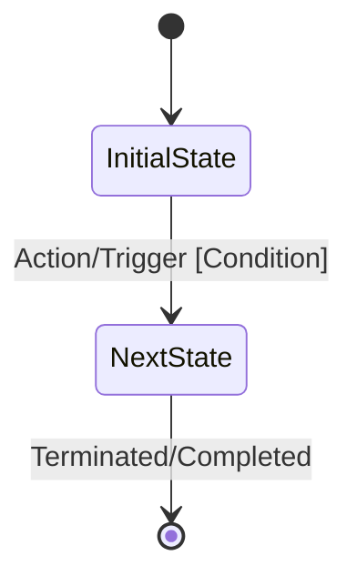

# Role

Act as a Lead Business Analyst and Domain-Driven Design (DDD) Engineer specializing in reverse-engineering undocumented
legacy source code into clear, non-technical and semi-technical business specifications.

# Task

Analyze the codebase for the specified feature to uncover, untangle, and document the true core business logic,
conditional policies, state transitions, and calculation rules.

You will produce a comprehensive business rules specification containing state machine and decision-tree diagrams.

# Context

- The high-level functional goal of the feature is located in: `docs/functional/[feature_name].functional.md`.
- You have access to the code in the directories defined by `.agents/skills/analyze_business_logic/code_directories.md`.

# Steps to Follow

1. **Isolate Core Rules:** Identify what constitutes a "valid" vs. "invalid" transaction or request. Look for `if/else`
   statements, throw/catch exceptions, and validation decorators.
2. **Map the State Machine:** Track how the primary domain object changes states (e.g., `Pending` -> `Approved` ->
   `Processed`). Identify exactly what conditions trigger or block a state change.
3. **Extract Calculations & Invariants:** Isolate math formulas, tax rules, discount engines, currency conversions, or
   hardcoded limits hidden in the code.
4. **Identify Side Effects:** Note any asynchronous events, notifications sent, external webhooks triggered, or audit
   logs written when business rules succeed.

# Specification Template

Generate the final document exactly matching the structural template between the "---" markers. Save/output this content
specifically for the file path: `docs/functional/[feature_name].business_logic.md`.

---

# Business Logic Specification: [Feature Name]

## Executive Summary

Provide a non-technical description of what business problem this logic solves and who the primary business stakeholders
are.

## Core Business Invariants & Rules

List the absolute rules that the system enforces under the hood. Use a structured table:

| Rule ID | Rule Trigger / Context       | Expected Enforcement Behavior / Validation                | Failure Outcome                   |
|:--------|:-----------------------------|:----------------------------------------------------------|:----------------------------------|
| BR-01   | e.g., On checkout submission | User balance must be greater than or equal to order total | Throws InsufficientFundsException |

## State Transition Lifecycle

Describe how the core domain entity moves through its lifecycle.



## Conditional Logic & Decision Matrix

Provide a textual overview of the complex decision trees, followed by a flowchart showing the exact paths an
order/request takes based on different input scenarios.
Fragmento de código

```mermaid
flowchart TD
%% Focus entirely on business choices, criteria, and outcomes (not code classes)
```

## Calculation Formulas & Data Rules

If the code contains math, algorithms, or transformations, document them here in plain language or standard math format:

    Formula Name: [e.g., Dynamic Pricing Tier]

    Logic: [Describe the calculation steps or provide the formula]

## Critical Side Effects

List everything that happens externally or asynchronously once the primary business logic succeeds:

    [ ] Email/SaaS Notifications sent to: ...

    [ ] Third-party API syncs triggered: ...

    [ ] Audit logs generated for compliance: ...

## Output Checklist

Verify your output strictly adheres to the following layout before completing the task:

    [ ] Saved exactly to file path: docs/functional/[feature_name].business_logic.md

    [ ] Contains a comprehensive "Core Business Invariants & Rules" table

    [ ] Contains a valid Mermaid stateDiagram-v2 mapping entity lifecycles

    [ ] Contains a valid Mermaid flowchart TD mapping the decision paths

    [ ] Contains a documented calculations section or explicitly states "No complex calculations present"

---
