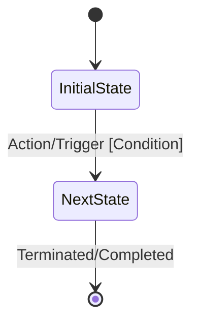

# [Feature] Business Logic

## Executive Summary

Provide a non-technical description of what business problem this logic solves and who the primary business stakeholders
are.

## Core Business Invariants & Rules

List the absolute rules that the system enforces under the hood. Use a structured table:

| Rule ID | Rule Trigger / Context       | Expected Enforcement Behavior / Validation                | Failure Outcome                   |
|:--------|:-----------------------------|:----------------------------------------------------------|:----------------------------------|
| BR-01   | e.g., On checkout submission | User balance must be greater than or equal to order total | Throws InsufficientFundsException |

## State Transition Lifecycle

Describe how the core domain entity moves through its lifecycle.



## Conditional Logic & Decision Matrix

Provide a textual overview of the complex decision trees, followed by a flowchart showing the exact paths an
order/request takes based on different input scenarios.
Fragmento de código

```mermaid
flowchart TD
%% Focus entirely on business choices, criteria, and outcomes (not code classes)
```

## Calculation Formulas & Data Rules

If the code contains math, algorithms, or transformations, document them here in plain language or standard math format:

    Formula Name: [e.g., Dynamic Pricing Tier]

    Logic: [Describe the calculation steps or provide the formula]

## Critical Side Effects

List everything that happens externally or asynchronously once the primary business logic succeeds:

    [ ] Email/SaaS Notifications sent to: ...

    [ ] Third-party API syncs triggered: ...

    [ ] Audit logs generated for compliance: ...
